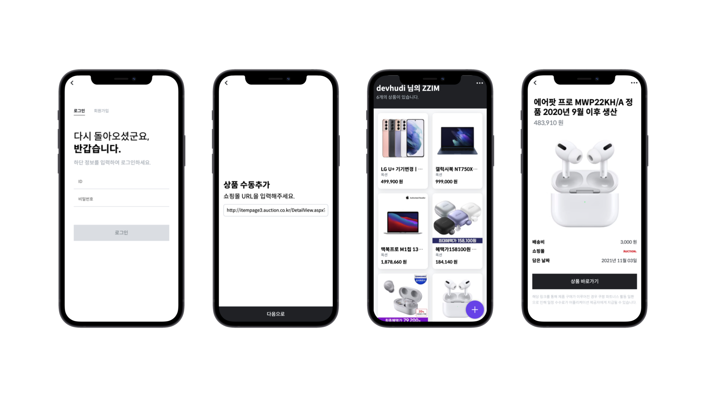

# <div style="text-align:center">ZZIM Frontend</div>

> **본 프로젝트는 2021년 IGRUS 제2회 인하대학교 IT 경진대회에 출품되어 대상을 수상하였습니다 🥇**



https://zzim.app

ZZIM 은 여러 쇼핑몰의 URL 만으로 관리할 수 있는 통합 위시리스트 서비스입니다. 지원하는 쇼핑몰의 상품 URL을 입력하면, 자동으로 상품 데이터를 파싱하여 나의 위시리스트에 추가합니다.

## Tech Stacks

- React
  - React Router
  - Redux
  - Styled Components
  - Axios

## Quick Start

```
$ npm run start
```

## Contributors

<table>
   <tr>
      <td align="center"><a href="https://github.com/devHudi"><br /><sub><b>devHudi<br/>(Donghyun Cho)</b></sub></a></td>
      <td align="center"><a href="https://github.com/sanvit"><br /><sub><b>sanvit
<br/>(Jaewon Kim)</b></sub></a></td>
      <td align="center"><a href="https://github.com/hgo641"><br /><sub><b>hgo641<br/>(Yeojin Hong)</b></sub></a></td>
      <td align="center"><a href="https://github.com/rxb8k"><br /><sub><b>rxb8k<br/>(Jinseo Song)</b></sub></a></td>
      <td align="center"><a href="https://github.com/Park-Jun-Hui
"><br /><sub><b>Park-Jun-Hui<br/>(Junhui Park)</b></sub></a></td>
   </tr>
</table>

## Related Links

- [Back-End Repository](https://github.com/sanvit/zzim-backend)
